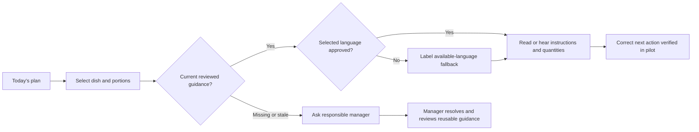

# Product requirements document

## Release update 29 September 2026

R01–R16 are implemented and engineering-accepted for the local release. Real kitchen content review and product outcomes remain unvalidated; US15–17 and protected access remain later gates.

[Current release, checks and remaining scope](CURRENT_RELEASE.md).

**Kitchen Guidance + Prep & Purchase — one-kitchen guidance release**  
Version 1.1 | 29 September 2026 | Owner: Group 1  
Status: detailed hypothesis-backed specification; local demo exists; customer validation and protected pilot pending.

## 1. Overview and strategic fit

The proposed product helps kitchen staff find the kitchen's own approved answer to a preparation decision when a knowledgeable person is unavailable. Its first complete flow is: **Today's dishes → select dish → see current quantities and approved method/photo → carry out the correct next action, or escalate a missing answer**.

Vision: kitchen knowledge remains usable during a real service, across interruptions and changes in who is present. Strategy: start in one Delhi–Gurgaon professional kitchen where the trusted answer may currently live with a chef, in a conversation or in a document. Demonstrate a recurring, consequential decision can be resolved better than the existing workaround before expanding into operations management.

The existing local Prep & Purchase app provides recipes, serving-based quantities, daily plans, receipt lots, draft purchasing and actual usage/waste records. These remain available. The current guidance addition creates a learning surface; passing its technical tests does not prove the initial problem.

Course fit: Session 6 physical pages 30–31 require research, success, scope, flows, release, assumptions and follow-up. This PRD supplies those sections and links the supporting documents. The mentorship asks for a functional product as far as possible with a limited niche and reasoned priorities.

## 2. Problem and jobs

**Hypothesized problem statement:** during a busy service, a cook facing an unfamiliar dish decision may be unable to obtain the kitchen's intended preparation/handling/substitution instruction in time. Asking around, retrieving old messages or guessing may delay work or produce inconsistent results. Frequency, consequence and dominant workaround are unmeasured.

| Candidate job | Situation and desired progress | Release position |
|---|---|---|
| J1: trusted guidance | When a task is unfamiliar and the senior person is unavailable, establish the kitchen-approved next action so the intended dish can proceed. | Provisional lead; test first. |
| J2: feasible prep/purchase | Before service, reconcile portions, ingredient demand and stock/arrivals so there is enough usable material at the right time. | Daily calculations and week calendar delivered; chronological cross-day allocation conditional. |
| J3: prepared-batch decisions | When several prepared batches exist, identify which is eligible, how much remains and what needs hold/review before serving. | Complete batch accounting conditional; requires a distinct model. |

Functional outcome: correct, timely action. Emotional outcome hypothesis: confidence without guessing. Social outcome hypothesis: preserve the kitchen's standard without continually interrupting senior staff. Do not equate these with demand for an app, voice or AI.

The competitor is the current habit, including a chef already nearby, wall sheet or WhatsApp. A better maintained wall card may win. If no repeated consequential stuck incident exists, do not force J1; reframe or stop that branch.

## 3. Users, scope and evidence

Primary actor: cook/prep assistant encountering the selected decision. Secondary actor: chef/manager who owns instructions and reviews both languages. Buyer/approver: kitchen owner or institutional operator, which may be the same person in a small house. Detailed [proto-personas](PERSONAS.md) identify unknowns without invented biographies.

Delhi–Gurgaon and Hindi/English are user decisions. Professional kitchen is the current project direction. Exact kitchen subtype, language proficiency, smartphone access, glove/noise/connectivity constraints and willingness to pay are unknown. The hostel sample data is fictional. Home cooking, multiple sites and broad language expansion are outside this release.

There are no completed primary interviews in the supplied materials. The [research document](RESEARCH_INSIGHTS.md) specifies tests and disconfirming evidence. Do not use synthetic responses, developer E2E tests or educational food-waste examples as customer findings.

## 4. Goals, non-goals and release boundary

Goals: make approved instructions discoverable; retain exact current quantity context; make approval/version/source ownership visible; suppress stale methods; preserve content/data across reload and recovery; evaluate whether the complete flow improves correct resolution versus the current alternative.

Completed sequence: documentation preceded implementation of a persistent Hindi/English interface choice with **separately reviewed bilingual guidance**. This sequence is complete for the current local release. Existing single-language guidance must remain valid and readable; untranslated content must be labelled, never silently transformed.

Non-goals for this increment: general conversational agent, automatic substitutions or cooking-policy generation, automatic purchasing, complete weekly ledger, full prepared-product ledger, universal food expiry, multi-site accounts, nutrition planning and home pantry. Authentication/hardening is mandatory before a shared pilot, although the present local demo has navigation-based staff/manager views only.

## 5. Functional requirements

| ID | Requirement | Acceptance criteria | Feature / story |
|---|---|---|---|
| R01 | Show Today and its plan context | Explicit service date; selected dish/portions and server-calculated ingredient quantities; empty state with useful date/navigation; loading/failure/retry distinct. Stock fetch failure must not conceal valid instructions. | F01,F06 / US01–02 |
| R02 | Show kitchen-approved guidance | Staff reads only current published content; owner and version visible; draft changes have no staff effect until explicit publish. Do not imply a published page is a verified safety assessment. | F02–05 / US03–04 |
| R03 | Separate manager draft/save/publish | Save persists draft; publish freezes reviewed content for the current recipe revision; pending/dirty state blocks conflicting operations; active/inactive context explicit. | F03 / US05 |
| R04 | Detect stale applicability | Method-relevant recipe/ingredient/quantity/unit changes invalidate approval; staff sees review needed and escalation. A plan-date or portions change alone rescales quantities without falsely invalidating the method. | F03 / US06 |
| R05 | Persist useful photos | Validated JPEG/PNG, bounded size/count/dimensions; published image retained when draft changes; clear missing-image fallback. Demo images labelled fictional/AI generated; real process/portion photos reviewed by kitchen owner. | F02 / US07 |
| R06 | Preserve exact quantities | Canonical units, no silent rounding of business arithmetic; current portions visible. E.g. 0.0125 kg × 30 portions = 0.375 kg, not 0.38 kg as the canonical result. UI formatting must not alter stock/demand calculations. | F06 / US02 |
| R07 | Support missing-answer escalation | Local queue tied to dish/context; safe retry does not duplicate same request; manager marks resolution visibly. Queue creation alone is not a resolved outcome; no automatic external message. | F23 / US08–09 |
| R08 | Hindi/English interface choice | Clearly named हिन्दी / English control in staff and manager entry; default Hindi for new device, persist preference across reload; document language and labels update; dates/numbers remain unambiguous; no data mutation on toggle. | F40 / US10 |
| R09 | Separately reviewed bilingual instructions | Manager can author/review Hindi and English for same recipe revision. Text, handling, substitutions, applicability, portion standard and next action are reviewed content. Published versions record which languages are available. Save/publish retains the current approval boundary; changing English draft never changes Hindi published content silently. | F41 / US11 |
| R10 | Explicit missing-language fallback | English selection with Hindi-only approved guidance: show Hindi with a clear language notice and escalation; converse equally. Never label fallback as translated. If recipe is stale, suppress methods in both languages, including fallback. No automatic translation. | F41 / US12 |
| R11 | Playback follows actual content language | Optional local voice reads the displayed approved content in its actual language; stop/replay supported. Missing matching local voice produces readable fallback. No default wrong-language voice, microphone or remote speech request. | F08 / US13 |
| R12 | Preserve existing manager operations | Receipts remain actual arrivals; purchase drafts do not add physical stock; usage/waste history preserved; existing date/portion/reload behavior and calculations retain regression checks. | Existing baseline / US14 |

R08–R11 are implemented and engineering-accepted in the local release. Actual-device voice availability and real reviewer semantic approval remain unvalidated. Bilingual authoring must make a language's approval explicit: a publication may expose only the available reviewed language(s); it must not require fabricated text to keep older Hindi documents readable. The implementation must make any partially reviewed language unavailable to staff until approved and preserve immutable prior publication snapshots. A shared explicit publish of the reviewed language set is acceptable; separate language releases require equally explicit version/applicability handling.

## 6. UX principles and flows

Staff sees the service task first, short method and quantity context second, optional detail third. Manager authoring is grouped into required method/owner and optional handling/substitutions/portion/source details. Avoid an inventory form between a question and its answer. Photos should identify process or standard; decorative photos do not establish correctness.

Language choice changes presentation, not numeric values, food rules or publishing rights. Dish/ingredient names and user-entered comments remain saved data unless separately reviewed translations are explicitly supplied. When language changes during editing, preserve the draft and dirty state. Any active speech stops before a new language/content starts.

Failure paths: empty plan, missing guide, stale recipe, incomplete translation, failed request, unavailable photo/voice, pending save, archived recipe and duplicate retry. Every failure keeps the context and provides the next action; none should invent a safe food answer.

## Additional authorized local demo scope: calendar and simpler flows

After the documentation request, the user directly requested a calendar, a portions dropdown from 30 to 100 in increments of ten, breakfast/lunch/dinner sections, meal timings and a usability revamp. This changes the immediate local implementation scope. It does not change the research evidence status or imply a completed pilot.

- **R13:** manager can navigate seven calendar days, select a date and add/edit/remove dishes in breakfast, lunch or dinner. Empty meals provide a clear Add dish action. Unclassified existing plans remain visible in Needs a meal.
- **R14:** each date/meal has one persisted editable serving time. Initial schedule defaults are 08:00, 13:00 and 20:00. Today shows the same meal and time as the planner. These times are scheduling metadata.
- **R15:** new plan quantities use eight labelled options: 30, 40, 50, 60, 70, 80, 90 and 100. An existing legacy value remains selectable when editing that plan; no old count is silently rounded or truncated. Daily ingredient quantities include every meal exactly once.
- **R16:** the menu is separate from Ingredients & buying and recipe maintenance. Today presents meal cards before dish details; local questions, calculations, settings, lot details and demo reset use explicit disclosures. Phone and desktop layouts remain readable, keyboard operable and free of page overflow in both interface languages.

The [implementation contract](UX_IMPLEMENTATION_CONTRACT.md) defines exact API, layout and regression gates. Chronological weekly stock reservation, future deliveries and prepared-batch eligibility remain later independent scope.

## Additional bounded UI refinement (integrated 29 September 2026)

The RestaurantIQ-inspired navy/blue/white shell, selected navigation and readable Hindi/English controls are integrated. Plan meals and New Guide search recipe names in both languages, preserve the selected recipe and portions while typing, and show no-match feedback. The manager strip shows selected-date planned entries including unassigned dishes; non-exhausted lots with recorded label dates before that date; and non-exhausted lots with unknown dates. Both lot counts link to More → Stock. Ingredient loading and refresh failures, including after a write, show unavailable rather than zero. Dates prompt review and do not determine food safety. Existing Questions behavior is unchanged; no question count/filter, table or chart was added. APIs, schema, dependencies and database are unchanged, and the 32-recipe catalog/data are preserved. Sol accepted 39 frontend tests across 10 files, lint with zero warnings and a 34-module production build; all eight isolated laptop/phone browser workflows passed. Live read-only Playwright confirmed Hindi/English recipe search, preserved selection and 50 portions during search, no-match feedback, Guides search, a 390px Hindi layout without overflow, and zero JS errors. The prior 39 backend tests are reused because this increment changes no backend code. No customer outcome is claimed.

## 7. Domain and technical approach

React frontend, Spring backend, MySQL persistence. Core workflows use deterministic data and arithmetic. Relevant entities: recipe revision/fingerprint, plan/date/portions, draft guide, immutable published guide snapshot, photo and local question. Bilingual fields/language variants belong to the same recipe applicability contract; they are not a separate unversioned copy in browser storage.

Raw lot: received ingredient amount and supplier/storage/date provenance. Prepared batch: production event consuming inputs and producing an actual yield, with lineage and a condition-specific deadline. These are distinct. Future batch model must reject recipe cycles, atomically consume/create, preserve units/yields, record hold/review state and prevent double deduction. Unknown deadline does not mean unlimited eligibility.

Future weekly allocation must advance chronologically, reserve each amount once, separate expected deliveries from actual stock and test preparation/holding/service deadlines. Curries, sauces and chutneys cannot all inherit one generic expiry. Applicable reviewed policy determines timestamps and eligibility; reheating does not automatically renew them.

No LLM API is needed for this release: UI dictionaries, reviewed bilingual content, quantities, publication, local questions and matching local speech are deterministic. Push-to-talk may require a speech service if device capability fails; evaluate field performance first. A general agent or automatic translation is a separate later product/evaluation decision, not an implicit dependency.

## 8. Nonfunctional requirements and pilot gates

| Area | Local release acceptance | Before protected kitchen pilot |
|---|---|---|
| Reliability | Backend/frontend/browser regressions; retries preserve intent; persistence after restart; recoverable backup including photos. | Restore rehearsal with pilot dataset and named owner; incident/recovery procedure. |
| Access | Staff/manager navigation clearly reflects local demo capability. | Server-enforced identity/roles and kitchen isolation; cannot authorize via UI tab alone. |
| Content integrity | Published snapshot, recipe staleness and language fallback tested. | Named kitchen reviewer, applicable policies, bilingual semantic comparison and review schedule. |
| Usability | Desktop/phone, keyboard controls, readable states and no overflow in covered flows. | Actual device, vocabulary, light/noise/hands/connectivity tests with intended staff. |
| Data/privacy | No automatic external messaging or remote speech/content submission. | Consent for observation/recording; minimum identifying data; retention/access agreed. |
| Performance | Measure full decision path including retries; do not substitute server speed for task speed. | Compare against baseline; acceptable behavior under actual connectivity. |

## 9. Success criteria and release acceptance

Proposed North Star: **weekly verified correct guidance-assisted decision resolutions per active kitchen**. A click, audio replay or submitted question does not count. Define the episode and verification as in [success metrics](SUCCESS_METRICS.md). Correctness, time, coverage, ongoing maintenance and appropriate escalation are guardrails.

Engineering acceptance requires current regression suite, fresh migration, upgrade preservation, restart/restore and actual browser checks, including Hindi→English→reload, single-language fallback, approved bilingual content, draft isolation and stale suppression. Product acceptance requires actual kitchen evidence; automation cannot complete that gate.

## 10. Risks, dependencies and review

| Risk / assumption | What changes the decision | Owner role |
|---|---|---|
| J1 may be infrequent or already solved | Recent incident and observation show the workaround is sufficient | Research lead |
| Staff may not use text/phone during rush | Compare wall card, photo, audio and app under actual conditions | UX/research |
| Guidance maintenance may exceed benefit | Measure setup/review time against staff/chef benefit | Kitchen manager + PM |
| Translation may alter meaning | Kitchen bilingual reviewer compares units, prohibition, substitution and applicability | Policy owner |
| Planner expansion could dilute focus | Need distinct repeated J2 incidents and reliable baseline stock | PM + engineering |
| Batch suggestions could misclassify eligibility | Need reviewed policies, temperatures/observations and complete lineage | Kitchen policy owner |

Open decisions: named first kitchen/actor, baseline recurrence, who reviews English, exact review cadence, protected deployment, measurement access and buyer economics. These are not blockers to the authorized local demo or documentation; they gate real pilot claims and broader release.

Review record: user requested this package and reviewed bilingual scope; Group 1 product review and kitchen-owner content sign-off are pending. Implementation completed in bounded Luna packets with Sol source/test audit and root runtime/integration verification. Roadmap and stories are linked, not separately invented commitments.

## Kitchen Saathi direction — implemented and locally verified

See [KITCHEN_SAATHI_DESIGN.md](KITCHEN_SAATHI_DESIGN.md) for the accepted contract. The user-selected institutional-mess/commercial-kitchen positioning remains unvalidated in the field. The 2:1 Cook/Manager bento, four source-backed manager metrics, weekday selector/reset, 350/custom portions and exact read-only recipe preview are implemented and locally verified. Hindi/English guidance review, stale-state suppression, fallback and escalation remain intact. Local live checks passed for the manager cards, weekday controls, preview without Save, Cook/Manager phone navigation, no overflow/errors/POSTs, and unchanged snapshots across all seven APIs. `npm ci` completed with 348 packages. Remote publication remains pending; this does not authorize unsupported supplier, PO or financial-performance claims.
