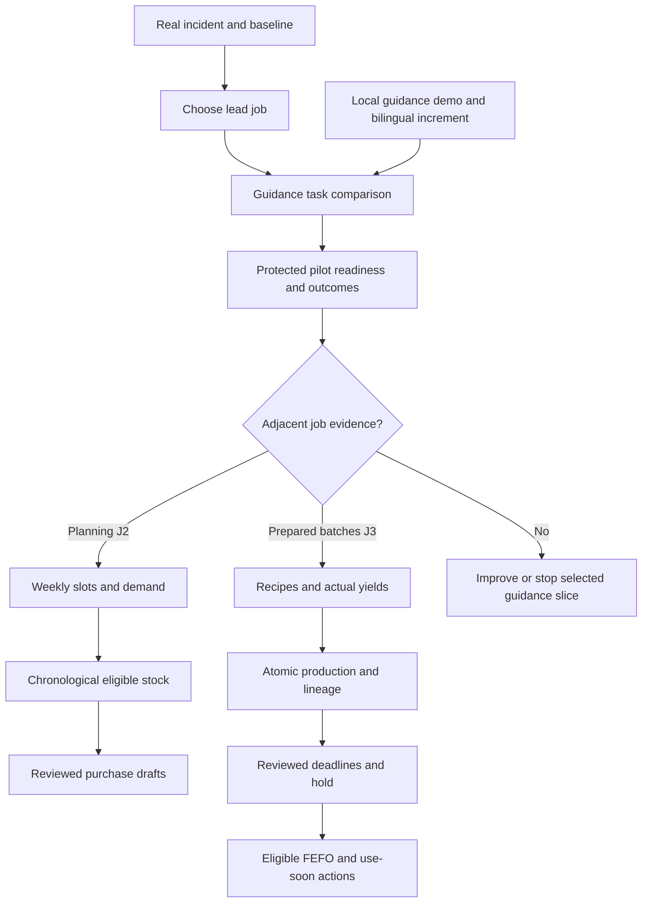

# Product roadmap and phased release plan

## Release update 29 September 2026

Phases2a/2b, the authorized calendar increment and the bounded RestaurantIQ-inspired visual/search/manager-strip refinement are engineering-complete. Discovery0–1 and pilot3 remain open; chronological allocation4 and prepared batches5 are not delivered.

[Current release, checks and remaining scope](CURRENT_RELEASE.md).

Version 1.1, updated 29 September 2026. Roadmap expresses outcomes, dependencies and evidence gates. It does not imply committed launch dates. It uses the Now/Next/Later approach taught in Session 6 physical page 20 and separates engineering delivery from research readiness.

## Vision → strategy → outcomes

Vision: kitchen knowledge remains usable at the moment a worker needs it. Strategy: one professional kitchen, one repeated decision, kitchen-owned instructions and reliable task context. First outcome: verified correct resolution faster/better than the actual workaround at sustainable maintenance cost. Planning and batch handling are possible adjacent strategies, each needing its own evidence.

## Now / Next / Later

| Horizon | Outcome/theme | Scope | Readiness / decision |
|---|---|---|---|
| Now | Concrete reviewable product definition | This documentation; evidence register, metrics, personas, stories and priorities | Complete; refreshed after build and GitHub publication |
| Now | Read current approved guidance in preferred language | Delivered Today, reviewed Hindi/English, photos/questions and local playback | Local engineering acceptance complete; customer value unvalidated |
| Delivered local demo | Navigate meals simply | Week calendar,30–100 portions, three meals, saved serving times and focused Guides |39frontend/8browser checks; prior39backend checks reused; no chronological reservation |
| Now | UI coherence and faster recipe finding | Shared navy/blue/white shell, clear active navigation, readable Hindi/English controls, language-aware recipe search in planner/New Guide with selection preserved, and selected-date plan/lot review counts linked to More → Stock; unavailable states on ingredient load/refresh failure | Delivered: 39 frontend tests/10 files, lint clean, build 34 modules, eight isolated browser workflows passed; live UI smoke passed. Existing 39 backend tests reused; no backend changes. Customer value unvalidated |
| Now | Select a real leading job | Recent-incident interviews and baseline from one accessible kitchen | No field interviews complete |
| Next | Demonstrate useful task improvement | Task comparison text/photo/audio/current workaround, actual device/vocabulary | Requires selected incident and content reviewer |
| Next | Operate a protected one-kitchen pilot | Server roles, real reviewed policies, recovery, measurement and setup | Local navigation-only demo does not satisfy this gate |
| Later, conditional | Plan seven days without allocating stock twice | Meal slots/servings, chronological projection, reviewed purchase drafts | J2 evidence and reliable baseline data required |
| Later, conditional | Use prepared products with correct eligibility/lineage | Nested recipes/yields, actual production, deadlines/hold, FEFO/service time | J3 evidence and applicable reviewed policies required |
| Later, conditional | Decision-led visual analytics | Charts or broad sortable tables | Only after a named manager decision, reliable data and task evidence justify them |
| Later, experimental | Better access/input where demonstrated | Speech lookup, offline, export/handover, source integration | Field constraint and access tests first |

The prototype was authorized and built before field discovery finished. That is an engineering choice for capstone feasibility, **not completion of research Phases 0–1**. Do not relabel those phases as done because a screen exists.

## Phase plan with tests and checks

| Phase / release | Objective and vertical slice | Key checks | Exit gate and owner |
|---|---|---|---|
| 0 — Select job and baseline | Manager recent incident → cook perspective → owner consequence; choose J1/J2/J3 | Actual tape/observation locators, workaround/frequency/consequence, contradictions; same kitchen not three independent samples | Group 1 research/PM documents repeated consequential need or reframes/stops |
| 1 — Compare smallest alternative | Reviewed text/photo/audio or wall card tested on selected task against current workaround | Correctness, total time, unsupported/stale recognition, language comprehension, manager upkeep | Kitchen reviewer + UX show a useful direction; no broad product claims |
| 2a — Local guidance demo | Today → dish → current quantity → published method/photo or escalation; preserve manager baseline | Backend/frontend/browser regressions; stale/draft/photo/retry; upgrade preservation, restart and backup restore | Complete: engineering audit + root runtime/recovery; independent from customer gate |
| 2b — Bilingual increment | Hindi/English UI preference and reviewed content for same recipe revision | Persist toggle; both reviewed languages; labelled fallback; dirty draft retained; speech matches actual content; immutable publication; old Hindi data preserved | Complete: Luna implementation, Sol audit, root integration; no customer validation implied |
| 3 — Protected one-kitchen pilot | Real user access, named policy owners, small real recipe set and observed outcomes | Server roles; reviewed policies/translation/photos; recovery; actual phone/network; consented outcome measurement | PM + operator confirm readiness; proposed pilot targets reviewed after baseline |
| 4 — Weekly planning, conditional | One week/service slots → exact demand → chronological stock → explained shortages → reviewed draft | Cross-day consumption/reservations, expiry at service, delivery timing, unit conversions, edit/stale draft, actual receipt separation | J2 incident evidence and reliable stock; accounting/reconciliation tests pass |
| 5 — Prepared products, conditional | Identified inputs → production/yield → prepared batch → eligible use/hold → usage/lineage | Cycles, nested quantities/yields, atomicity, no double deductions, timestamp/storage/unknown state, no expiry renewal, FEFO | J3 incident evidence, reviewed applicable policies and complete lineage |
| 6 — Demonstrated enhancements | One validated bottleneck at a time: read-only speech, offline, handover/export/source pipeline | Accuracy/time benefit, version freshness, confirmations/rights as applicable; deterministic alternative comparison | Promote only when outcomes and maintenance justify added complexity |

Suggested learning windows once access exists: initial incidents/observation over several services, first directional round of 20 tasks across at least three shifts, then a proposed two-week protected pilot. These are research proposals, not calendar commitments or sufficient samples for all kitchens. Engineering effort will be estimated per accepted packet; no arbitrary dates tied to absent capacity.

## Dependencies and branch decisions

The weekly and batch branches need not both be built next. A use-soon suggestion depends on eligibility, not merely an early date. Source references cannot replace kitchen review. Displaying a recipe translation does not confer publishing authority.

## AI, speech and external references

No LLM API needed for local guidance, bilingual reviewed fields, exact arithmetic, lot records, weekly rules or batch accounting. Local matching-language playback needs device capability and has text fallback. Read-only speech lookup remains a field experiment; a speech API may be necessary if local recognition is inadequate. An open agent/voice writes requires separate grounded-answer and confirmed-action evaluation.

PDF references: select applicable passages/edition/conditions, resolve conflicts, review and publish a kitchen instruction. EatByDate: optional attributed link first; authorized data integration only after interface/rights and condition/provenance checks. No automated shelf-life override or scraped consumer date turned into a kitchen batch policy.

## Initial rollout and course-based GTM

The first channel is an accessible local kitchen that permits discovery and appoints a reviewer, not a mass advertising campaign. Group 1 conducts discovery before showing the product, then invites a bounded task test separately. Seed a few actual reviewed recipes and a service plan; staff receive a short orientation and exception example. Observe independent reuse and operator willingness to continue.

Provisional value proposition for later testing: **Find your kitchen's current approved answer for today's dish, with the right quantities and a clear next step when the answer is missing.** Do not market proven waste savings, regulatory compliance or an autonomous chef. Pricing, TAM/SAM/SOM, paid acquisition and revenue projections remain unvalidated; no invented numbers are supplied to make the roadmap appear commercial.

Expansion gate: demonstrate value and maintainability at the first kitchen; then test comparable kitchens and contrasting workflows before broad claims. Home pantry, multi-site and nutrition remain separate discovery tracks. Capstone slides should use the mentorship's eventual provided structure; the current record says 7–8 slides and no finalized template, so this package does not invent a slide order.

## Ownership and review rhythm

Group 1 collectively owns product decisions; assign an actual research lead and kitchen contact before recruiting. PM owns definitions/priorities; researcher owns evidence; kitchen reviewer owns intended food instructions and language equivalence; engineering owns deterministic behavior/data integrity. User requested GPT‑6 Luna implementers with GPT‑6 Sol auditor/manager; they work in bounded packets, with actual source and test review before root integration.

During pilot, review incorrect/stale/unanswered cases daily and outcome/maintenance data weekly. Update roadmap when evidence changes the job or a dependency, recording rationale. Reserve contingency in delivery estimates; remove Could scope first. Shared pilot readiness cannot be waived by a high RICE score.

## Same-day roadmap amendment: requested calendar demo

The user subsequently requested an urgent menu calendar and usability overhaul. Build this bounded local slice now: persisted meal slots/times, seven-day navigation, the 30–100 portions selector, simplified planning/Today views and bilingual interface. This supersedes deferral of the calendar UI; it does not bring forward weekly stock reservation, prepared batches or claims of field validation. Luna builds sequential backend, core UX and remaining-operation packets; Sol reviews actual source and checks; root verifies preservation and integrates the live demo. Browser resets run on a separate database and server.

No delivery date is invented. Release requires real calendar save/reload, exact ingredient arithmetic, legacy-data preservation, bilingual review/fallback and readable laptop/phone screenshots. The detailed [usability contract](UX_IMPLEMENTATION_CONTRACT.md) is the current implementation scope.

## Immediate review checklist

1. Documentation coverage and source/evidence labels reviewed.
2. Bilingual content semantics, existing publication compatibility and fallback specified.
3. Actual app passes language/persistence/regression checks and release verification records exact results.
4. First kitchen, actor, reviewer and observation access identified.
5. Baseline collected; proposed success thresholds calibrated.
6. Shared pilot protections and real content checked before launch.

Items1–3 are engineering/documentation-complete for the current local release, with real content semantics still subject to kitchen review. Items 4–6 remain field/pilot work; app completion must not mark them achieved.
