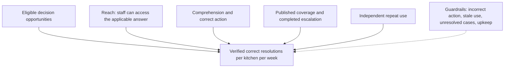

# Success metrics and North Star metric

## Release update 29 September 2026

Engineering results are39 backend/33 frontend/8 browser workflows. The North Star and all customer/business baselines remain not measured; no automatic outcome instrumentation was added.

[Current release, checks and remaining scope](CURRENT_RELEASE.md).

Version 1.1, updated 29 September 2026. **All product baselines are currently unknown. All targets below are proposals for a pilot, not achieved results.** Developer tests establish engineering behavior only. The current app does not automatically measure the North Star.

## Proposed North Star

**Weekly verified correct guidance-assisted decision resolutions per active kitchen.**

This measures the intended customer progress: a staff member facing the selected decision establishes and carries out the correct next action with help from current approved guidance or a completed manager escalation. It connects maintained kitchen knowledge to actual task outcomes. The outcome-first approach is informed by [Amplitude's North Star Playbook](https://amplitude.com/books/north-star); this exact definition is our proposal.

Definition:

| Term | Operational meaning |
|---|---|
| Week | Monday 00:00 to Sunday 23:59 in Asia/Kolkata for the pilot. Record timezone and dates explicitly. |
| Active kitchen | Enrolled pilot kitchen with at least one observed/recorded eligible decision episode in that week, including weeks with zero resolutions. App login alone is not activity. |
| Eligible decision episode | One real instance of the selected J1 decision, with kitchen/date/shift/task/actor context, start point and outcome. Questions created by tests or invented to increase counts excluded. |
| Guidance-assisted | Approved current content or a contextual manager response materially contributed to the decision. Merely opening a card is insufficient. |
| Correct resolution | Correct next action completed and independently confirmed by the named kitchen reviewer/observer against the intended standard and applicable context. |
| Appropriate escalation | Counts only after the manager response leads to a verified correct next action, including a genuinely required hold/stop. An unanswered question or “ask someone” button alone never counts. |
| Duplicate | Repeat clicks/replays/retries for the same episode count once. A changed decision/task is a separate episode only if independently eligible. |
| Verification | Manual observed task result plus reviewer identity/version/context during early pilot. Self-reported confidence alone is insufficient. |

Formula for kitchen k in week w: **count of distinct eligible episodes with guidance contribution and verified correct resolution**. Show individual kitchen counts and the median across active kitchens, alongside eligible episode counts, unresolved outcomes and hours/shifts observed. Do not hide zero-resolution kitchens by excluding them from the denominator.

Example **hypothetical only**: 12 eligible decisions, 8 card-assisted correct actions, 1 completed escalation with verified appropriate hold, 2 unresolved questions and 1 incorrect action yield 9 counted resolutions, with the incorrect action separately triggering review. This is not observed pilot data. A high count cannot compensate for consequential incorrect advice.

## Why alternatives are supporting metrics

Card views/DAU can grow without any useful answer. Audio plays can reflect replay/confusion. A lower interruption count can mean staff are guessing. Queue closure can be administrative. Waste percentage involves several causes beyond guidance. These are diagnostic measures; none alone demonstrates J1 progress.

The North Star also has limits: a kitchen with more problems can generate more resolutions; successful training may reduce future questions. Report eligible-episode rate, correctness and maintenance alongside the count. If guidance becomes primarily preventive rather than incident resolution, or J2/J3 becomes the leading job, review the metric definition using real evidence rather than distorting the count.

## Metric tree

## Product scorecard

| Metric | Definition / denominator | Proposed pilot interpretation | Method and owner |
|---|---|---|---|
| Correct supported-task rate | Verified correct actions / all eligible supported episodes, including abandonment/failure | Proposed ≥90% for first directional round; record counts, not just percentage | Observer + kitchen reviewer |
| Correct unsupported/stale recognition | Episodes where staff appropriately seek review/hold / all tested unsupported/stale cases | Proposed 100% in controlled cases; any misleading answer blocks expansion | Research + content owner |
| Time to correct next action | Start uncertainty to verified correct action, including device retrieval, retries and escalation wait | Proposed median ≥25% faster than matched current workaround with correctness maintained | Timed task comparison; PM |
| Guidance coverage | Eligible decisions with current applicable reviewed language/content / all eligible observed decisions | Establish baseline first; proposed ≥80% of the deliberately narrow selected task set before live trial | Research + manager |
| Independent reuse | Comparable shifts where intended user voluntarily uses and correctly resolves / shifts with opportunity | Proposed reuse in at least 2 later eligible shifts; prompting reported separately | Observer/diary, PM |
| Wrong/consequential action | Number and severity of incorrect actions linked to displayed guidance, translation or quantities | Any consequential incorrect advice pauses that content/task and triggers diagnosis | Kitchen reviewer + engineer |
| Stale content exposure | Staff method/photo from wrong recipe revision / all stale tests or recorded stale contexts | Zero in covered software tests; monitor pilot deviations | Engineering + policy owner |
| Unanswered resolution | Time to useful manager response; unresolved count and age | Baseline and service-specific commitment agreed with owner; queue creation excluded | Local question log + manual outcome |
| Language comprehension | Correct actions and correct fallback recognition by actual displayed language | Compare Hindi/English; do not pool a weaker language into overall average | Bilingual reviewer + UX |
| Maintenance burden | Initial setup and weekly review/photo/translation minutes, by role | Net benefit must exceed upkeep; proposed review ≤30 min/week for a small 5-dish trial, to be calibrated | Manager time log |
| Activation | Complete approved setup + one correct staff task and one correct exception task | One enrolled kitchen is a learning milestone, not market validation | PM + manager |
| Continued operation | Kitchen elects to continue after proposed 2-week pilot, with own maintained content | Record reasons and commercial conditions; no fabricated willingness-to-pay threshold | Owner interview |

These proposed thresholds are deliberate decision aids, not universal kitchen benchmarks. Calibrate once real task complexity, episode frequency and baseline are known. Twenty tasks across three shifts can reveal a serious usability defect; they cannot prove general population effectiveness or regulatory safety. Report n, tasks, kitchen count, prompted/unprompted conditions and all exclusions.

## Engineering versus product versus business success

| Layer | What establishes success | What it cannot establish |
|---|---|---|
| Engineering | Correct calculations, state isolation, API/migration tests, actual browser flow, data survival and restore | Staff need, preference, adoption or waste savings |
| Product | Observed correct resolution and time/reuse improvement against actual workaround | Scalable demand, sustainable pricing or all-kitchen generalization |
| Business | Real buyer accepts ongoing operating burden and commercial terms; continued use at later comparable sites | Guaranteed revenue from prototype enthusiasm |

The verification report records current engineering results. This scorecard remains unpopulated until actual field research. Do not enter zero for unknown baselines; mark **not measured**.

## Course-aligned AARRR and basic unit economics

The supplied `7/7.txt` asks for a simple customer/business KPI framework. Apply AARRR to this narrow pilot without treating a large funnel as established:

| Stage | Proposed measure | Current status / interpretation |
|---|---|---|
| Acquisition | Eligible kitchen agrees to a discovery or separate task session / eligible kitchens approached | Not measured; team-led recruiting, no automated outreach authorized |
| Activation | Kitchen completes reviewed setup and staff's first correct supported + exception task | Not measured; sample-data demo is not customer activation |
| Retention | Kitchens with independent useful reuse in later eligible shifts / activated kitchens with opportunities | Not measured; prompted visits separated |
| Referral | Operator voluntarily introduces a comparable kitchen after experiencing value | Not measured; introductions and actual sessions distinguished |
| Revenue | Buyer accepts specified ongoing terms and actually pays / kitchens offered those terms | No pricing or paying customers established |

Track initial setup, bilingual review, support, hosting/storage and optional speech cost per maintained kitchen. Basic future contribution margin is paid revenue minus variable delivery/support costs; customer acquisition cost includes the team's real recruiting/onboarding effort. Lifetime value needs observed revenue, margin and retention/churn; do not compute it from an invented lifetime or a single free pilot. No numerical CAC/LTV, conversion or revenue target is defensible yet. Customer task benefit and manager upkeep should be measured before pricing or scale forecasts.

## Measurement plan

Early pilot can use a consented manual episode sheet instead of building an analytics platform. Fields: episode ID, kitchen pseudonym, role, shift/date, J1 task, supported/missing/stale, selected UI language, actual content language, version, start/end timestamps, workaround or product condition, prompts/retries, escalation outcome, correctness reviewer, result, failure cause and upkeep minutes. Keep identifying data minimal.

Proposed later local events: `today_opened`, `dish_selected`, `guidance_displayed` with publication/version/content language, `language_changed`, `fallback_shown`, `stale_shown`, `question_created`, `question_resolved`, `decision_outcome_verified`. UI events are inputs, not resolution proof. Outcome event requires reviewer evidence and episode de-duplication. No external analytics vendor is required for the initial learning test.

Compare equivalent tasks/conditions; vary order to reduce learning bias. Report median and spread, all failures and kitchen-specific results. Do not infer causality from a before/after waste total: menus, staff, season, deliveries and covers may differ.

## Conditional planning/batch metrics

If J2 is selected: service-ready plans without quantity shortages, forecast-versus-actual portions, correction burden and justified draft accuracy; drafts do not count as food available. If J3 is selected: correct eligible-batch selection, complete lineage, held/unknown cases and reconciliation accuracy. Waste metrics require reason-coded quantities and actual purchase prices; only attributable changes can support savings claims. These require their own baseline and should not be multiplied into the J1 North Star.

Review cadence: during pilot, review failures daily and outcomes/maintenance weekly. Group 1 PM owns definitions; kitchen owner validates correct action; engineering owns data integrity. Change the North Star only with an explicit lead-job decision and documented rationale.
